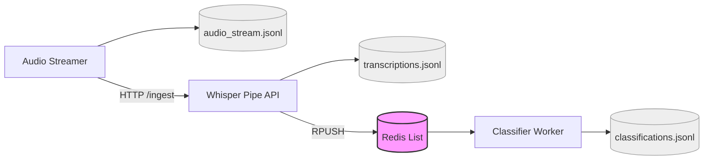

# PyConv

> **PyConv je robustní Pipeline pro streaming audio -> transkripci -> klasifikaci konverzace.**


## Co je implementováno end-to-end

1. Projekt je local-first. Podobná konverzace by neměla dle mého názoru být přeposílána na žádné cizí servery.
2. Audio Streamer načte audio soubor po krátkých 0.032sec úsecích přes FFmpeg, normalizuje na PCM s16le, 16 kHz, mono.
3. Audio se přes VAD skládá do řečových segmentů.
4. Segmenty se serializují do JSON (včetně base64 PCM payloadu) a posílají HTTP POSTem do transkripční služby.
5. Whisper služba segmenty přepisuje na text (word-level timestamps), obsahuje robustní deduplikační systém pro překryvy, sliding context window a ukládá JSONL log.
6. Přepsané segmenty se pushují do Redis fronty.
7. Classifier služba čte Redis stream, dělá průběžnou klasifikaci přes Ollama a ukládá klasifikační JSONL výstup.

## Architektura



## Modul 1: Audio Streaming Layer

Implementováno v `audio_streamer`:

- Async FFmpeg reader přes `asyncio.create_subprocess_exec`.
- Normalizace výstupu na jednotný formát:
	- sample rate 16 kHz,
	- mono kanál,
	- PCM s16le (2 B/sample).
- Simulace real-time streamu podle wall-clocku (load chunk cadence).
- VAD segmentace přes Silero VAD (`torch.hub`).
- Konfigurovatelné parametry:
	- `load_chunk_sec`,
	- `max_segment_length_sec`,
	- `silence_limit_sec`,
	- `overlap_sec`.
- Ošetření short tail chunku (padding nulami) a graceful cleanup subprocessu.
- Asynchronní odesílání segmentů dál přes interní frontu + worker (fire and forget).
- Zvolen lokálně na hostu mimo docker z důvodu škálování a různých přítoků audia -> např. mikrofon -> jednodušší a spolehlivější integrace.

### Důležité chování v implementaci

- Overlap je použit pouze při nuceném střihu dlouhého segmentu (`max_segment_length_sec`).
- Při VAD ukončení promluvy (silence end) overlap záměrně nepoužívám.
	- Šetří to výpočet a bandwidth.
	- Časová osa zůstává čistší bez umělého vracení ticha. -> problémy při tichu na např. 20 sec (jak pak zarovnat text pokud overlap pochází ještě ze staré konverzace?)

### JSON chunk výstup

Aktuální model navíc obsahuje `vad_cut`:

- `vad_cut = true`  -> segment ukončen VAD (přirozený konec řeči),
- `vad_cut = false` -> segment ukončen max délkou (nucený střih).

Tohle pole se dál používá při post-processingu textu v transkripčním modulu -> také info zdali chunk obsahuje overlap.

## Modul 2: Transcription Engine

Implementováno v `whisper_pipe`:

- FastAPI ingest endpoint `POST /ingest`.
- Interní `asyncio.Queue` + background worker.
- Transkripce přes `faster-whisper` (`WhisperModel`).
- Word-level timestamps (`word_timestamps=True`).
- Výstup do append-only JSONL logu.
- Publikace transkriptů do Redis listu (`RPUSH`) pro downstream klasifikátor.
- `GET /health` endpoint s metrikami interní queue + Redis.

### Sliding context + deduplikace

Použitá je kombinace dvou mechanismů:

1. Whisper `initial_prompt` z poslední historie slov.
2. Deduplikace nového textu proti historii přes `SequenceMatcher` (`get_diff_text`).

Výsledek:

- menší opakování textu na hranách chunků,
- lepší kontinuita mezi segmenty,
- čistší stream pro klasifikátor.

### Engineering detail: práce s interpunkcí

`vad_cut` flag z modulu 1 řídí finální text cleanup:

- u nucených střihů (`vad_cut=false`) se ořezává koncová tečka,
- u přirozených VAD cutů (`vad_cut=true`) se ponechává.

To pomáhá proti artefaktům, kdy model u uměle useknutých vět častěji halucinuje zakončení.

### Výkon / hardware trade-off

Transcriber volí compute režim podle HW:

- CPU / lokální Mac vývoj: `compute_type=int8`,
- CUDA GPU produkce: `compute_type=float16`.

Je to záměrný kompromis mezi rychlostí, pamětí a přesností podle prostředí.

### Diarizace

- V kódu je připravená větev pro pyannote (`Pipeline.from_pretrained`).
- Ve výchozím běhu je diarizace vypnutá (`diarization=False`).
- Tj. diarizace je teď částečně připravená, ale není plně dotažená do funkčního robustního režimu.
    - v plánu bylo vytvořit in-memory speaker-registry s embeddingy každého SPEAKER_ID. při každém novém hcunku se porovná nový embeddings s registry dle cosine similarity -> při podobnosti se použije již uložené ID, zprůměruje se jeho embedding pro improving precision. Při nepodobném embeddingu se vytvoří nový klíř SPEAKER_ID.

## Modul 3: Classifier

Implementováno v `classifier`:

- Asynchronní consumer z Redis (`BLPOP`).
- Sliding/batch klasifikace po batches (`chunk_batch_size=5`).
- Kontextová paměť posledních n-posledních batches (`deque`), která se přidává do promptu.
- LLM klasifikace přes Ollama (`AsyncClient.chat`, JSON mode).
- Validace odpovědi přes Pydantic model.
- Ukládání klasifikačních segmentů do append-only JSONL.
- Retry loop při výpadku připojení k Ollama.

### Klasifikační výstup

Poznámka: výstup je průběžný po oknech, ne jen jednorázový finální verdict na konci session.

Limit je využití LLM-based přístupu. Pokud bych měl více času a přístup k validním datům určitě bych zvolil fine-tuning vlastního clasifikátoru, avšak je problém sehnat takové niche labelled data.
- Proto je také spousta polí v OllamaReponse optional, model občas halucinuje a chunk neprojde validací (přístup radši nějaká data - hlavně clasifikace, než úplně zahodit)

## Engineering Highlights

1. Asynchronní chain bez blocking I/O ve zpracovatelské větvi.
2. Jasné oddělení modulů (audio ingest, STT, klasifikace) přes explicitní hranice.
3. Redis jako decoupling buffer mezi STT a klasifikací (odolnější na rozdílnou propustnost).
4. Sliding context + text deduplikace na hranách chunků (lepší kvalita downstream NLP).
5. Promyšlená práce s overlapem: jen kde dává smysl, ne plošně.
6. HW-aware inferenční režim Whisperu (int8 CPU vs float16 CUDA).
7. Pydantic validace datových kontraktů mezi službami.
8. Docker Compose orchestrace pro Redis + Whisper service + Classifier service.

## Bonusy proti zadání

- Docker Compose setup (Redis + transkripce + classifier): hotovo.
- Incremental klasifikace: hotovo (průběžná klasifikace po batch oknech + context z n-posledních batches).
- Eval data: hotovo (syntetické private/topic_based datasety v `classifier/eval_data` + jejich syntetické audio verze v `audio_streamer/data`).
- Speaker diarization off-the-shelf: pouze rozpracovaný základ, defaultně vypnuto.

## Jak spustit

### Předpoklady

- Docker + Docker Compose
- Lokálně nainstalovaný Ollama runtime (na hostu)
- Model v Ollama (default v compose: `qwen3.5:9b-q4_K_M`)
- Pro lokální běh audio streameru: FFmpeg

### 1) Spuštění služeb přes Compose

Z rootu projektu:

```bash
docker compose up --build
```

Tím se spustí:

- `redis_service`
- `whisper_service` na portu `8000`
- `classifier_service`

### 2) Spuštění Audio Streameru (lokálně)

V separátním terminálu:

```bash
cd audio_streamer
uv run main.py
```

Defaultně streamuje soubor `audio_streamer/data/private_01.wav` do `http://localhost:8000/ingest`.

## Konfigurace přes environment proměnné

### whisper_pipe

- `REDIS_URL` (povinné)
- `REDIS_LIST_NAME` (default `transcribed_chunks`)
- `LOG_PATH`
- `HF_HOME`

### classifier

- `REDIS_URL` (povinné)
- `REDIS_LIST_NAME` (default `transcribed_chunks`)
- `OLLAMA_URL` (povinné)
- `OLLAMA_MODEL_NAME` (default v compose: `qwen3.5:9b-q4_K_M`)
- `LOG_PATH`

## Výstupy

- Audio streamer log JSONL: `.logs/audio_streamer/audio_stream.jsonl`
- Whisper transkripce JSONL: `.logs/whisper_pipe/transcriptions.jsonl`
- Klasifikace JSONL: `.logs/classifier/classifications.jsonl`

## Známé limity aktuální verze

1. Testy zatím chybí.
3. Diarizace není dotažená do produkčního workflow.

## Trade-offs a rozhodnutí

- Upřednostněna modulární asynchronní architektura před jedním monolitem.
- Redis fronta zvyšuje robustnost pipeline za cenu vyšší infra complexity.
- LLM klasifikátor přes Ollama umožní rychlý iterativní vývoj promptu bez tréninku vlastního modelu -> těžké sehnat labelled data.
- VAD + max segment délka je praktický kompromis mezi latencí, kvalitou transkripce a náklady.

## Co by šlo doplnit v další iteraci

1. Unit testy pro schémata + klasifikátor + text dedup logiku.
2. Finální session-level aggregator (souhrnná klasifikace za celou konverzaci).
3. Produkční diarizace s mapováním speaker identity napříč segmenty.
4. WebSocket broadcast transkriptů/klasifikace v reálném čase.
5. Eval skript nad datasetem s metrikami přesnosti.