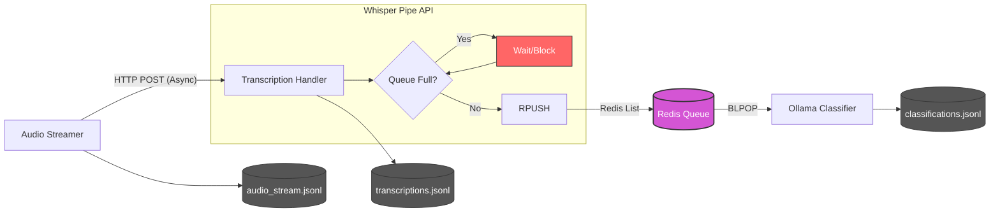

# PyConv

> **A robust, local-first streaming pipeline for audio capture, transcription, and real-time conversation classification.**

PyConv is an asynchronous, microservices-based audio processing pipeline that streams audio, detects speech, transcribes it to text, and uses a Large Language Model (LLM) to extract structured insights on the fly. Designed with privacy and performance in mind, the entire pipeline runs locally.

## Features

### 🎙️ 1. Intelligent Audio Streaming
- **Real-Time Simulation & Normalization:** Asynchronously reads and normalizes audio chunks via FFmpeg (16kHz, PCM s16le, Mono) to simulate real-time streams.
- **Voice Activity Detection (VAD):** Powered by Silero VAD, actively stripping silence and dynamically slicing speech into optimal segments.
- **Smart Overlaps & Cuts:** Applies audio overlaps only on forced duration cuts to preserve word boundaries, while keeping natural pauses clean to save compute and bandwidth.
- **Fire-and-Forget Ingestion:** Serializes segments (including base64 PCM payloads) and streams them asynchronously via HTTP POST to the backend pipeline.

### 📝 2. Robust Transcription Engine
- **Powered by Faster-Whisper:** Performs high-speed local inference with word-level timestamps.
- **Context-Aware Deduplication:** Employs a sliding context window and robust edge-case text deduplication to dramatically reduce hallucinations across chunk boundaries.
- **Punctuation Artifact Mitigation:** Uses `vad_cut` flags to determine whether to clean up trailing punctuation, stabilizing the LLM downstream.
- **Asynchronous Queueing:** FastAPI ingests chunks into an internal queue with built-in backpressure before pushing the transcribed results to Redis.

### 🧠 3. Real-Time LLM Classifier
- **Streaming Context Memory:** Consumes transcribed segments from Redis and maintains a context window over recent conversational batches.
- **Structured Data Extraction:** Interfaces with Ollama (e.g., `qwen3.5`) in JSON mode to continuously detect topics, sentiment, and intents.
- **Pydantic Validation:** Ensures absolute predictability in the classification outputs with rigorous schema validation.

## Architecture


```mermaid
flowchart LR
    A[Audio Streamer] --> L1[(audio_stream.jsonl)]
    A -- "HTTP POST (Async)" --> B
    
    subgraph API [Whisper Pipe API]
        B[Transcription Handler] --> P{Queue Full?}
        P -- "Yes" --> W[Wait/Block]
        W --> P
        P -- "No" --> R
        R[RPUSH]
    end

    B --> L2[(transcriptions.jsonl)]
    R -->|Redis List| RL[(Redis Queue)]
    RL -->|BLPOP| C[Ollama Classifier]
    C --> L3[(classifications.jsonl)]

    style RL fill:#d455d4,stroke:#333,stroke-width:2px,color:#fff
    style L1 fill:#555,stroke:#333,color:#fff
    style L2 fill:#555,stroke:#333,color:#fff
    style L3 fill:#555,stroke:#333,color:#fff
    style W fill:#f66,stroke:#333,color:#fff
```

## Getting Started

### Prerequisites
- [Docker](https://docs.docker.com/get-docker/) and Docker Compose
- [Ollama](https://ollama.com/) installed on your host machine
- The targeted classification model pulled locally (e.g., `ollama pull qwen3.5:9b-q4_K_M`)
- `ffmpeg` installed on the host (for the audio streamer service)
- `uv` (or pip) for running the local audio streamer

### 1. Launch the Pipeline (Docker Compose)
From the project root, start the Redis broker, Transcriber API, and LLM Classifier worker:

```bash
docker compose up --build
```
This exposes the transcription ingestion endpoint at `http://localhost:8000`.

### 2. Run the Audio Streamer (Locally)
In a separate terminal, launch the streamer to feed audio into the pipeline. You must specify the source audio file and a unique session identifier:

```bash
cd audio_streamer
uv run main.py --file data/private_01.wav --session session_01
```

**CLI Arguments:**
- `--file`: Path to the source audio file.
- `--session`: Unique session identifier for tracking the conversation across services.

Once started, it will stream the provided sample file to the ingestion endpoint at `INGEST_URL (http://localhost:8000/ingest)`.

## Configuration & Logs

The services are highly configurable via Environment Variables (e.g. `REDIS_URL`, `OLLAMA_MODEL_NAME`, `HF_HOME`). 

All components output append-only JSONL logs containing granular system states, exact timestamps, and derived outputs:
- **Audio Stream:** `.logs/audio_streamer/audio_stream.jsonl`
- **Transcriptions:** `.logs/whisper_pipe/transcriptions.jsonl`
- **Classifications:** `.logs/classifier/classifications.jsonl`